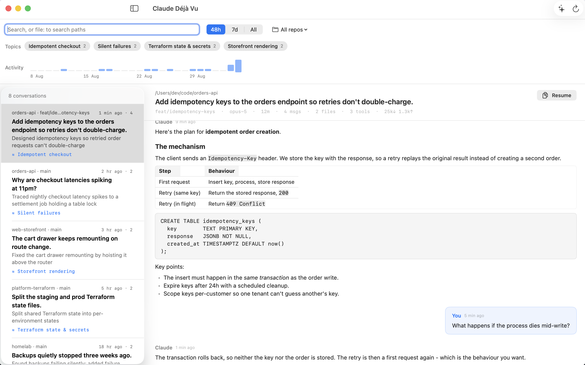
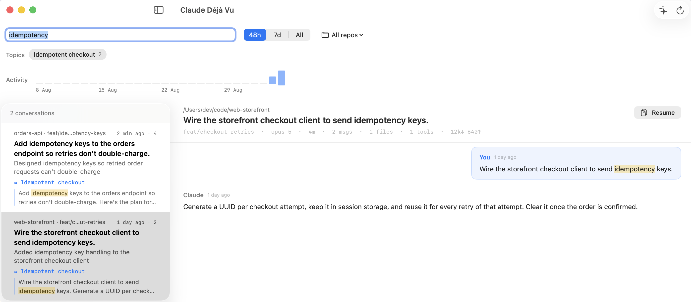

# Claude Déjà Vu

**[xsreality.github.io/claude-deja-vu](https://xsreality.github.io/claude-deja-vu/)**

Find that conversation you had with Claude Code, the one you can't remember which project it was in.

If you run Claude Code across many terminals and repos, related discussions end up scattered. Claude Déjà Vu reads the session logs Claude Code already writes to `~/.claude/projects/` and gives you one searchable view of them: browse recent conversations, search every message across every project, find the conversation that touched a given file, read the full transcript, and optionally let Claude group related conversations into topics that span repos.



*Screenshots use fictional sample data.*

## What it does

- **See what you've been working on.** Conversations from the last 4 weeks, newest first, with the project, git branch, age, and message count.
- **Search everything.** One box searches the full text of every message in every conversation. Results show a snippet with the match in context, so you can tell which conversation is the one you want.
- **Find the conversation that touched a file.** Type `file:` and a path fragment. Completions appear as you type, and the results are the conversations where Claude read or edited that file.
- **See when it happened.** An activity strip shows one bar per day across the whole 4-week window. Click a day to filter the list to it. When you search, the strip narrows to days with matches, so it answers "which week was that?" before you start scrolling.
- **Jump straight to the match.** Open a search result and the transcript scrolls to the first hit, with every occurrence highlighted.
- **Read comfortably.** Transcripts render markdown (headings, lists, tables, and code blocks) instead of a wall of raw text.
- **See what a conversation was made of.** Each transcript header carries the model, how long it ran, the message count, and the files and tools it touched.
- **Follow along live.** The open transcript updates as the conversation continues in your terminal.
- **Resume where you left off.** One click copies the `cd … && claude --resume …` command for the conversation you're reading.
- **Group related work (optional).** *Cross-reference* asks Claude to read your recent conversations and group them into topics. Topics span projects, so "auth migration" can pull together conversations from three different repos. Each conversation also gets a one-line summary of what it was actually about.



## Requirements

- macOS 14 (Sonoma) or newer
- Claude Code, with some existing session history
- The `claude` CLI on your `PATH`, **only** if you want the Cross-reference feature

## Install

```bash
brew trust xsreality/tap
brew install xsreality/tap/claude-deja-vu
```

This installs `DejaVu.app` into `/Applications`, so Spotlight and Launchpad find it like any other app. `brew trust` is Homebrew's approval step for a third-party tap; without it the install stops and does nothing.

Or download `ClaudeDejaVu-*.dmg` from the [latest release](https://github.com/xsreality/claude-deja-vu/releases/latest) and drag the app to Applications.

Either way, the app is signed ad-hoc rather than notarised by Apple, so macOS asks about it the **first** time you open it: **System Settings → Privacy & Security → Open Anyway**. See [Verifying what you installed](#verifying-what-you-installed) for what you can check instead of a notarisation ticket.

## Using it

**Browsing.** The app opens showing the last 48 hours. Switch to **7 days** or **All** (the full 4-week window) with the buttons in the top bar. Click any conversation on the left to read it on the right.

**Searching.** Type in the search box. The list narrows to conversations containing your term, each showing a snippet of the match. The time range applies to search too: start with **48h** for something recent, widen to **All** when you're digging.

**The activity strip.** Under the search box, one bar per day for the last 4 weeks, sized by how many messages that day held. Hover a bar for the date, the conversation and message counts, and which projects the day went to. Click one to see only that day, and the range switches to **All** so the day is reachable whatever you were looking at, and clicking again clears it. The strip always covers the full window, not the selected range, so a spike three weeks back is still visible while you're browsing the last 48 hours. It reflects your search: with a term in the box, only days containing matches have bars.

**Searching by file.** Start the search with `file:` to search paths instead of prose, as in `file:CartDrawer.tsx`. A list of matching files drops down as you type; pick one with the arrow keys or the mouse to narrow to the conversations that touched exactly that file. Each result shows which paths matched. Only files Claude actually read or wrote are indexed, so this finds work, not directory listings.

**One repo at a time.** The repo menu in the top bar narrows the whole view (list, search, and activity strip) to a single project.

**Picking it back up.** Every open conversation has a **Resume** button. It copies `cd <project> && claude --resume <id>`. Paste it into a terminal to carry on where you left off.

**Cross-reference.** Click **Cross-reference** to have Claude read your recent conversations and group them. It takes about a minute and calls the `claude` CLI once. When it finishes:

- Each conversation shows a one-line summary of what it covered.
- A **Topics** bar appears with each topic and how many conversations it contains.
- Click a topic to filter the list to it; click again to clear.

Results are cached in `~/Library/Application Support/DejaVu/insights.json`, so they load instantly afterwards and no further Claude calls happen until you click Cross-reference again. Delete that file to reset. Re-run it after a few days of new work to refresh the grouping.

## Privacy

- The app **only reads** your session logs. It never modifies or deletes them.
- Browsing and searching are entirely local and make no network calls at all.
- **Cross-reference is the one exception:** it sends a short excerpt of each recent conversation (about 700 characters per conversation, sampled from the start, middle, and end) to Claude via the `claude` CLI. That's the same trust boundary as using Claude Code itself, and it only happens when you click the button.

## Verifying what you installed

Every release is built by a GitHub Actions workflow in this repository and carries a signed [build provenance attestation](https://docs.github.com/actions/security-guides/using-artifact-attestations). You can check that the DMG you downloaded came from this repository's workflow, and not from anywhere else:

```bash
gh attestation verify ClaudeDejaVu-0.1.2.dmg \
  --repo xsreality/claude-deja-vu \
  --signer-workflow xsreality/claude-deja-vu/.github/workflows/release.yml
```

That verifies, against Sigstore's public transparency log, which commit and which workflow produced the file. The Homebrew cask runs the same check before it will pin a new release, so a `brew install` only ever fetches a DMG whose provenance was verified.

The release also carries `SHA256SUMS`, and the cask pins the DMG's SHA-256, so Homebrew refuses a download whose bytes don't match.

What this does **not** give you is Apple notarisation, which needs a paid Apple Developer account, so the one-time "Open Anyway" step stays. If you'd rather run only code you compiled yourself, build from source below; the app has no third-party dependencies.

To report a security problem, see [SECURITY.md](SECURITY.md).

## Building from source

```bash
swift run DejaVu --selftest      # assert the parsing layer
./Scripts/make-app.sh            # build build/DejaVu.app
./Scripts/make-dmg.sh            # package it as a DMG
./Scripts/make-icon.sh           # regenerate the icon from Resources/icon.svg
```

`swift build` is enough on its own; `make-app.sh` only wraps the binary in a `.app` so it gets a dock icon and a double-click launch. There are no third-party dependencies, and no Xcode project. The Xcode command line tools are all you need.

Two environment variables point the app somewhere other than your live logs, which is how the screenshots above are taken:

```bash
python3 Scripts/demo-data.py /tmp/demo
DEJAVU_PROJECTS_DIR=/tmp/demo/projects DEJAVU_INSIGHTS=/tmp/demo/insights.json \
  build/DejaVu.app/Contents/MacOS/DejaVu
```

The knobs are constants at the top of the sources:

| Setting | Default | What it does |
|---|---|---|
| `weeks` | `4` | How far back to scan; older conversations are ignored entirely |
| `maxAnalyzeSessions` | `40` | How many recent conversations Cross-reference sends to Claude |
| `sampleChars` | `700` | How much of each conversation is sampled for Cross-reference |
| `maxCompletions` | `20` | How many paths the `file:` autocomplete offers at once |

## Good to know

- **Only the last 4 weeks are visible.** This keeps it fast and the list relevant. Raise `weeks` if you want more history.
- **Cross-reference covers the 40 most recent conversations,** not all of them. Sending everything overwhelms the CLI, so it's capped deliberately.
- **Topic quality varies.** The grouping comes from a sample of each conversation, so it's a helpful index, not a perfect one.

## License

MIT
