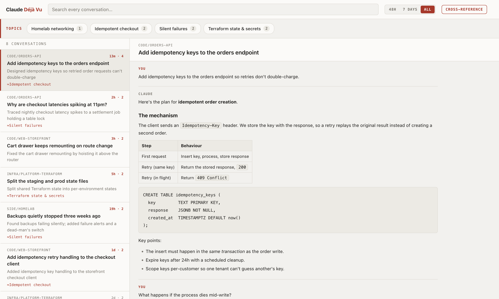

# Claude Déjà Vu

Find that conversation you had with Claude Code — the one you can't remember which project it was in.

If you run Claude Code across many terminals and repos, related discussions end up scattered. Claude Déjà Vu reads the session logs Claude Code already writes to `~/.claude/projects/` and gives you one searchable view of them: browse recent conversations, search every message across every project, find the conversation that touched a given file, read the full transcript, and optionally let Claude group related conversations into topics that span repos.



*Screenshots use fictional sample data.*

## What it does

- **See what you've been working on.** Conversations from the last 4 weeks, newest first, with the project, git branch, age, and message count.
- **Search everything.** One box searches the full text of every message in every conversation. Results show a snippet with the match in context, so you can tell which conversation is the one you want.
- **Find the conversation that touched a file.** Type `file:` and a path fragment. Completions appear as you type, and the results are the conversations where Claude read or edited that file.
- **See when it happened.** An activity strip shows one bar per day across the whole 4-week window. Click a day to filter the list to it. When you search, the strip narrows to days with matches — so it answers "which week was that?" before you start scrolling.
- **Jump straight to the match.** Open a search result and the transcript scrolls to the first hit, with every occurrence highlighted.
- **Read comfortably.** Transcripts render markdown — headings, lists, tables, and code blocks — instead of a wall of raw text.
- **Resume where you left off.** One click copies the `cd … && claude --resume …` command for the conversation you're reading.
- **Group related work (optional).** *Cross-reference* asks Claude to read your recent conversations and group them into topics. Topics span projects, so "auth migration" can pull together conversations from three different repos. Each conversation also gets a one-line summary of what it was actually about.


## Requirements

- Python 3.8 or newer (no packages to install — standard library only)
- Claude Code, with some existing session history
- The `claude` CLI on your `PATH` — **only** if you want the Cross-reference feature

## Getting started

### The Mac app (Homebrew)

```bash
brew install xsreality/tap/claude-deja-vu
dejavu
```

Builds from source — you need the Xcode command line tools (`xcode-select --install`). To keep the app in Launchpad:

```bash
ln -s "$(brew --prefix claude-deja-vu)/DejaVu.app" ~/Applications/
```

### The Python viewer (any platform)

```bash
git clone https://github.com/xsreality/claude-deja-vu.git
cd claude-deja-vu
python3 python/dashboard.py
```

Then open **http://127.0.0.1:8765**. Press `Ctrl-C` to stop it.

Nothing to configure and nothing to install. It reads your existing logs each time you load the page, so conversations you're having right now show up when you refresh.

## Using it

**Browsing.** The tool opens showing the last 48 hours. Switch to **7 days** or **All** (the full 4-week window) with the buttons in the top bar. Click any conversation on the left to read it on the right.

**Searching.** Type in the search box. The list narrows to conversations containing your term, each showing a snippet of the match. The time range applies to search too — start with **48h** for something recent, widen to **All** when you're digging.

**The activity strip.** Under the search box, one bar per day for the last 4 weeks, sized by how many messages that day held. Hover a bar for the date, the conversation and message counts, and which projects the day went to. Click one to see only that day — the range switches to **All** so the day is reachable whatever you were looking at, and clicking again clears it. The strip always covers the full window, not the selected range, so a spike three weeks back is still visible while you're browsing the last 48 hours. It reflects your search: with a term in the box, only days containing matches have bars.

**Searching by file.** Start the search with `file:` to search paths instead of prose — `file:dashboard.py`. A list of matching files drops down as you type; pick one with the arrow keys or the mouse to narrow to the conversations that touched exactly that file. Each result shows which paths matched. Only files Claude actually read or wrote are indexed, so this finds work, not directory listings.

**Picking it back up.** Every open conversation has a **Resume** button. It copies `cd <project> && claude --resume <id>` — paste it into a terminal to carry on where you left off.

**Cross-reference.** Click **Cross-reference** to have Claude read your recent conversations and group them. It takes about a minute and calls the `claude` CLI once. When it finishes:

- Each conversation shows a one-line summary of what it covered.
- A **Topics** bar appears with each topic and how many conversations it contains.
- Click a topic to filter the list to it; click again to clear.

Results are saved to `python/insights.json`, so they load instantly afterwards and no further Claude calls happen until you click Cross-reference again. Delete it to reset. Re-run it after a few days of new work to refresh the grouping.

**Linking.** The URL tracks what you're looking at, so you can bookmark a view or paste it into your notes:

- `http://127.0.0.1:8765/#<conversation-id>` — opens that conversation
- `http://127.0.0.1:8765/?q=retry&scope=7d` — opens that search

## Privacy

- The tool **only reads** your session logs. It never modifies or deletes them.
- It serves on `127.0.0.1` — nothing is exposed to your network.
- Browsing and searching are entirely local and involve no network calls.
- **Cross-reference is the one exception:** it sends a short excerpt of each recent conversation (about 700 characters per conversation, sampled from the start, middle, and end) to Claude via the `claude` CLI. That's the same trust boundary as using Claude Code itself, and it only happens when you click the button.

## Adjusting it

The knobs are constants at the top of `python/dashboard.py`:

| Setting | Default | What it does |
|---|---|---|
| `PORT` | `8765` | Port the dashboard serves on |
| `WEEKS` | `4` | How far back to scan; older conversations are ignored entirely |
| `MAX_ANALYZE_SESSIONS` | `40` | How many recent conversations Cross-reference sends to Claude |
| `SAMPLE_CHARS` | `700` | How much of each conversation is sampled for Cross-reference |
| `MAX_COMPLETIONS` | `20` | How many paths the `file:` autocomplete offers at once |

Two environment variables are useful for pointing the viewer somewhere other than your live logs:

```bash
DEJAVU_PROJECTS_DIR=/path/to/logs DEJAVU_INSIGHTS=/path/to/insights.json python3 python/dashboard.py
```

## Good to know

- **Only the last 4 weeks are visible.** This keeps it fast and the list relevant. Raise `WEEKS` if you want more history.
- **Cross-reference covers the 40 most recent conversations,** not all of them. Sending everything overwhelms the CLI, so it's capped deliberately.
- **Topic quality varies.** The grouping comes from a sample of each conversation, so it's a helpful index, not a perfect one.
- **It's a personal tool, not a service.** No database, no auth, no packaging — a single file you run when you need it.

To check the parsing logic still works after any change:

```bash
python3 python/dashboard.py --selftest
```

## License

MIT
